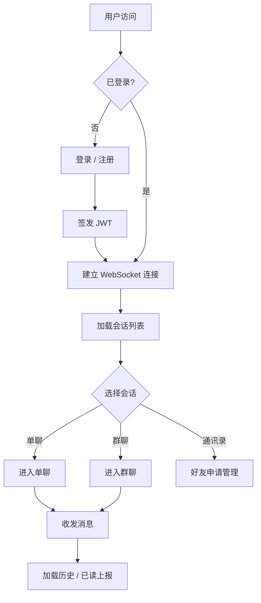
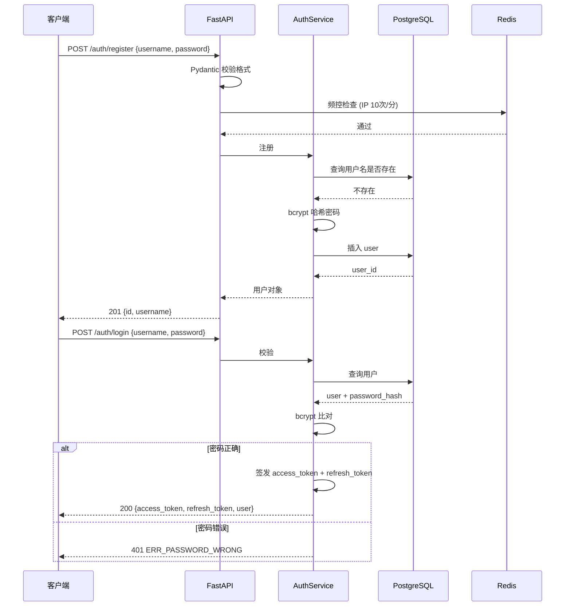
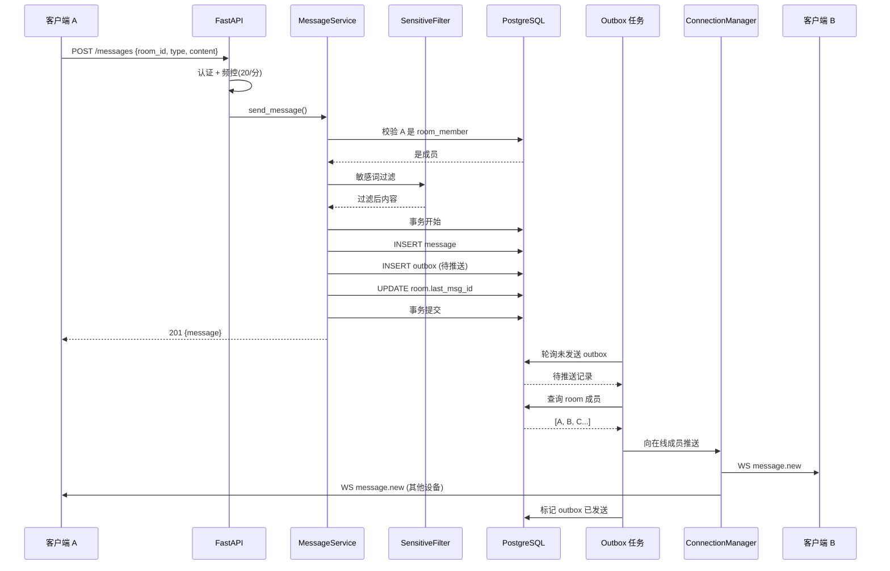
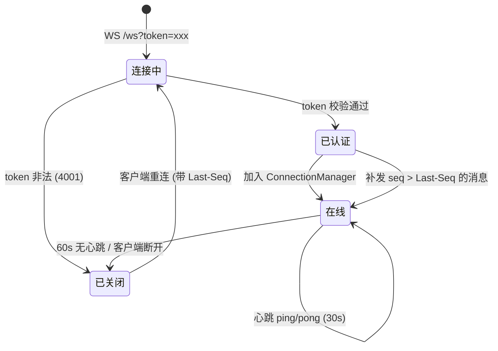
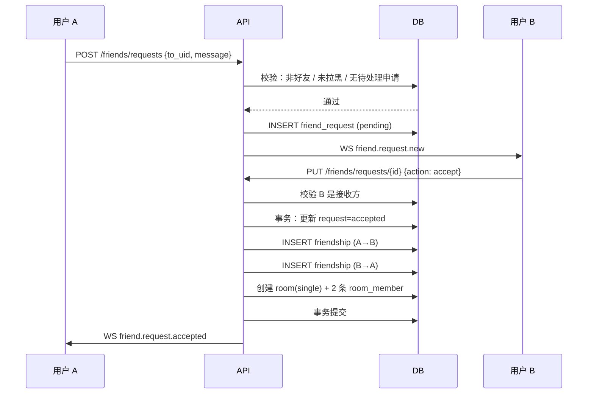
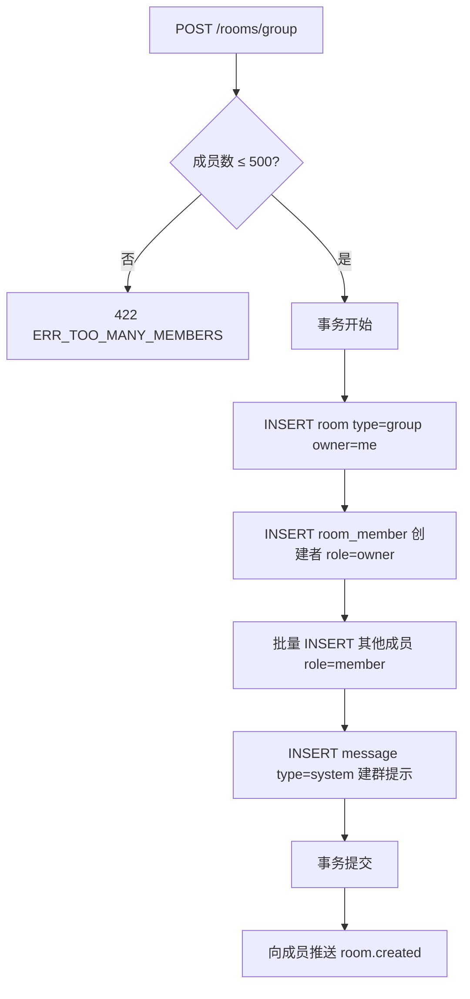
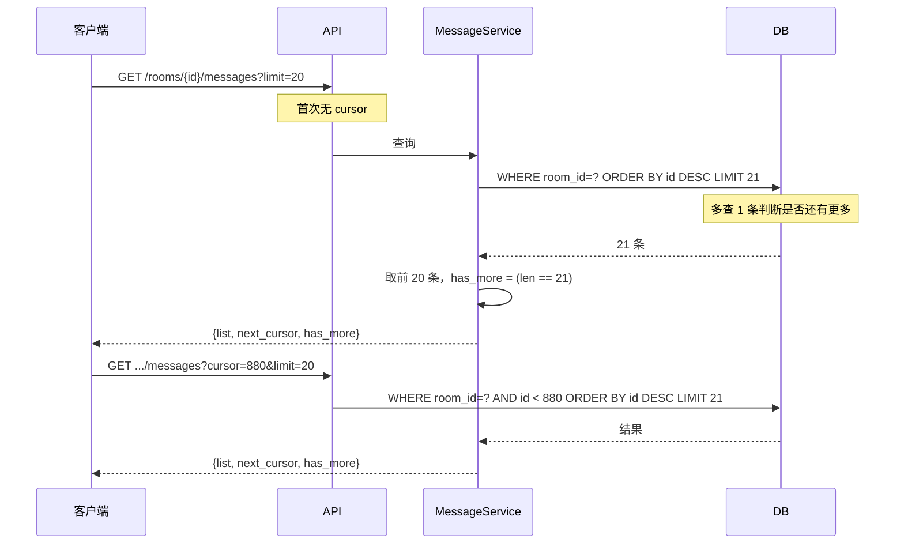
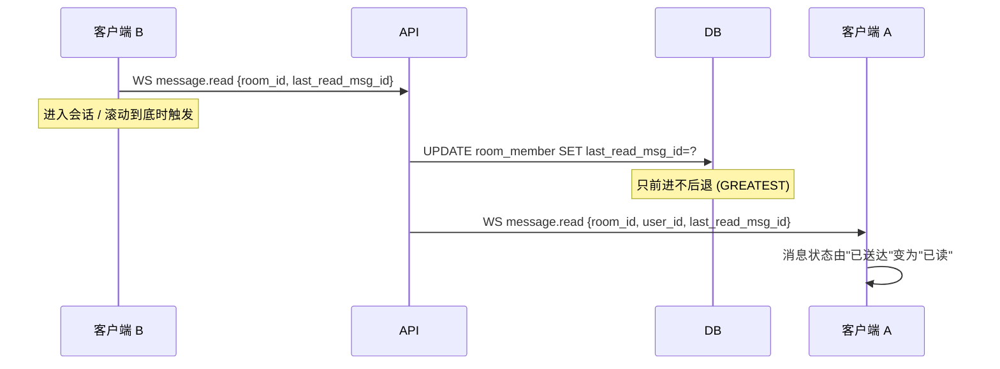
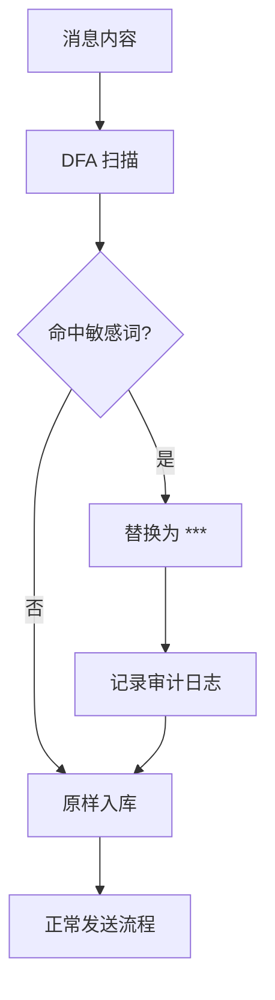
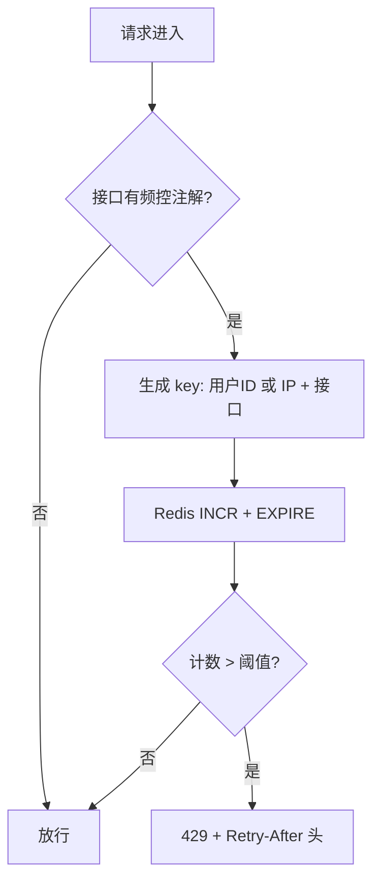

# 03 · 业务流程

> 定位：核心链路的时序与分支——让 BE / FE / QA 对"流程长什么样"有一致理解
> 状态：v1.0
> 图例：mermaid 语法，可用 Obsidian / VS Code 插件 / mermaid.live 渲染

---

## 1. 全局流程概览



---

## 2. 注册与登录



**关键分支**
- 用户名已存在 → `409 ERR_USERNAME_TAKEN`
- 频控触发 → `429 ERR_RATE_LIMITED`
- 参数非法 → `422`（Pydantic 自动）

---

## 3. 发送消息（核心链路）



**为什么 A 也走推送？** 用户可能开多个标签页，其他标签页需要同步。
A 自己发消息的那个 tab 用 HTTP 响应渲染，不依赖推送（避免重复渲染）。

**失败处理**
- 事务失败 → 整体回滚，返回错误，消息不存在
- 推送失败 → 消息已落库，outbox 重试（指数退避，最多 5 次）
- 重试仍失败 → 标记 `dead_letter`，记录日志告警

---

## 4. WebSocket 连接生命周期



**重连补偿**
```
Client → Server: WS /ws?token=xxx&last_seq=12345
Server → Client: [补发 seq 12346, 12347, ...]
Server → Client: {"type":"sync.done"}
```

---

## 5. 好友申请



**好友关系是双向两条记录**，查询好友列表时只查 `user_id = me`，避免 `OR` 查询（利于索引）。

**拒绝**：只更新 request 状态为 `rejected`，不建关系。

---

## 6. 创建群聊



---

## 7. 加载历史消息（游标分页）



**`has_more` 判定技巧**：查 `limit + 1` 条，若返回满则说明还有下一页。
避免额外的 `COUNT(*)` 查询。

---

## 8. 已读回执



**只前进不后退**：
```sql
UPDATE room_member
SET last_read_msg_id = GREATEST(last_read_msg_id, :new_value)
WHERE room_id = :room_id AND user_id = :user_id;
```
防止客户端乱序上报导致已读回退。

---

## 9. 敏感词过滤（发送侧）



> 策略为**替换**而非拒绝（决策 5）。用户不会遇到"消息莫名发不出去"的困惑。
> 审计日志保留原文 hash，便于追溯，不存明文。

---

## 10. 频控流程



| 接口 | 维度 | 阈值 |
|:---|:---|:---|
| `/auth/login` | IP | 10 次/分钟 |
| `/auth/register` | IP | 3 次/分钟 |
| `POST /messages` | 用户 | 20 条/分钟 |
| `POST /files` | 用户 | 10 次/分钟 |
| WS 连接 | IP | 20 次/分钟 |
