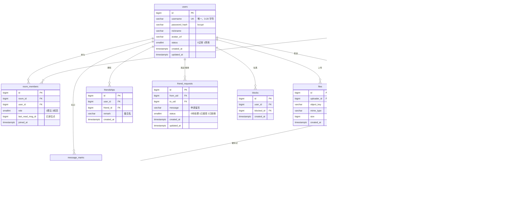

# 05 · 数据模型与 ER 图

> 定位：系统里有哪些实体、它们什么关系、索引怎么建
> 状态：v1.0 · 待 DBA 评审

---

## 1. ER 图



---

## 2. 建表 DDL（核心表）

```sql
-- 用户
CREATE TABLE users (
    id            BIGSERIAL PRIMARY KEY,
    username      VARCHAR(20)  NOT NULL UNIQUE,
    password_hash VARCHAR(255) NOT NULL,
    nickname      VARCHAR(50),
    avatar_url    VARCHAR(500),
    status        SMALLINT     NOT NULL DEFAULT 0,
    created_at    TIMESTAMPTZ  NOT NULL DEFAULT now(),
    updated_at    TIMESTAMPTZ  NOT NULL DEFAULT now()
);

-- 会话（单聊群聊统一抽象）⭐
CREATE TABLE rooms (
    id           BIGSERIAL PRIMARY KEY,
    type         SMALLINT    NOT NULL,          -- 1单聊 2群聊
    name         VARCHAR(100),
    avatar_url   VARCHAR(500),
    owner_id     BIGINT,
    last_msg_id  BIGINT,
    member_limit INT         NOT NULL DEFAULT 500,
    created_at   TIMESTAMPTZ NOT NULL DEFAULT now(),
    updated_at   TIMESTAMPTZ NOT NULL DEFAULT now()
);

-- 会话成员
CREATE TABLE room_members (
    id                BIGSERIAL PRIMARY KEY,
    room_id           BIGINT      NOT NULL,
    user_id           BIGINT      NOT NULL,
    role              SMALLINT    NOT NULL DEFAULT 2,  -- 1群主 2成员
    last_read_msg_id  BIGINT      NOT NULL DEFAULT 0,
    joined_at         TIMESTAMPTZ NOT NULL DEFAULT now(),
    UNIQUE (room_id, user_id)
);

-- 消息
CREATE TABLE messages (
    id          BIGSERIAL PRIMARY KEY,
    room_id     BIGINT      NOT NULL,
    from_uid    BIGINT      NOT NULL,
    type        SMALLINT    NOT NULL DEFAULT 1,
    content     TEXT,
    reply_to_id BIGINT,
    extra       JSONB,
    status      SMALLINT    NOT NULL DEFAULT 0,   -- 0正常 1删除
    created_at  TIMESTAMPTZ NOT NULL DEFAULT now()
);

-- 消息互动标记
CREATE TABLE message_marks (
    id         BIGSERIAL PRIMARY KEY,
    msg_id     BIGINT      NOT NULL,
    user_id    BIGINT      NOT NULL,
    mark_type  SMALLINT    NOT NULL,   -- 1点赞 2点踩
    created_at TIMESTAMPTZ NOT NULL DEFAULT now(),
    UNIQUE (msg_id, user_id, mark_type)
);

-- 好友（双向两条记录）
CREATE TABLE friendships (
    id         BIGSERIAL PRIMARY KEY,
    user_id    BIGINT      NOT NULL,
    friend_id  BIGINT      NOT NULL,
    remark     VARCHAR(50),
    created_at TIMESTAMPTZ NOT NULL DEFAULT now(),
    UNIQUE (user_id, friend_id)
);

-- 好友申请
CREATE TABLE friend_requests (
    id         BIGSERIAL PRIMARY KEY,
    from_uid   BIGINT      NOT NULL,
    to_uid     BIGINT      NOT NULL,
    message    VARCHAR(200),
    status     SMALLINT    NOT NULL DEFAULT 0,  -- 0待处理 1接受 2拒绝
    created_at TIMESTAMPTZ NOT NULL DEFAULT now(),
    updated_at TIMESTAMPTZ NOT NULL DEFAULT now()
);

-- 黑名单
CREATE TABLE blocks (
    id         BIGSERIAL PRIMARY KEY,
    user_id    BIGINT      NOT NULL,
    blocked_id BIGINT      NOT NULL,
    created_at TIMESTAMPTZ NOT NULL DEFAULT now(),
    UNIQUE (user_id, blocked_id)
);

-- 本地消息表（可靠异步）
CREATE TABLE outbox (
    id            BIGSERIAL PRIMARY KEY,
    topic         VARCHAR(50) NOT NULL,
    payload       JSONB       NOT NULL,
    status        SMALLINT    NOT NULL DEFAULT 0,  -- 0待发 1已发 2死信
    retry_count   INT         NOT NULL DEFAULT 0,
    next_retry_at TIMESTAMPTZ,
    created_at    TIMESTAMPTZ NOT NULL DEFAULT now()
);

-- 敏感词
CREATE TABLE sensitive_words (
    id         BIGSERIAL PRIMARY KEY,
    word       VARCHAR(100) NOT NULL UNIQUE,
    level      SMALLINT     NOT NULL DEFAULT 2,
    created_at TIMESTAMPTZ  NOT NULL DEFAULT now()
);

-- 文件
CREATE TABLE files (
    id          BIGSERIAL PRIMARY KEY,
    uploader_id BIGINT      NOT NULL,
    object_key  VARCHAR(500) NOT NULL,
    mime_type   VARCHAR(100),
    size        BIGINT,
    created_at  TIMESTAMPTZ NOT NULL DEFAULT now()
);
```

---

## 3. 索引规划（提前建，别事后补）

```sql
-- 消息：游标分页主索引 ⭐ 最关键
CREATE INDEX idx_msg_room_id_created ON messages (room_id, id DESC);

-- 会话成员：查"我的会话列表"
CREATE INDEX idx_member_user ON room_members (user_id);

-- 会话成员：查"某群的成员"
CREATE INDEX idx_member_room ON room_members (room_id);

-- 消息：按发送者查（撤回、审计）
CREATE INDEX idx_msg_from ON messages (from_uid);

-- 好友：查好友列表
CREATE INDEX idx_friend_user ON friendships (user_id);

-- 好友申请：查收到的申请
CREATE INDEX idx_freq_to_status ON friend_requests (to_uid, status);

-- outbox：轮询未发送
CREATE INDEX idx_outbox_pending ON outbox (status, next_retry_at)
    WHERE status = 0;

-- 消息标记：查某消息的点赞
CREATE INDEX idx_mark_msg ON message_marks (msg_id, mark_type);
```

### 索引使用验证（必须做）

写完查询后用 `EXPLAIN ANALYZE` 确认走索引：

```sql
EXPLAIN ANALYZE
SELECT * FROM messages
WHERE room_id = 123 AND id < 10000
ORDER BY id DESC LIMIT 20;
```

**期望看到**：`Index Scan using idx_msg_room_id_created`，不是 `Seq Scan`。

---

## 4. 关键设计说明

### 4.1 为什么 `messages` 不存"已读"字段

已读状态是**每个成员各自**的，不是消息的固有属性。
放在 `room_members.last_read_msg_id` 上：
- 一条消息在百人群里只需存 1 份，而不是 100 份已读状态
- 未读数 = `COUNT(messages WHERE id > last_read_msg_id)`

### 4.2 为什么 `friendships` 是双向两条

| 方案 | 查询好友列表 | 问题 |
|:---|:---|:---|
| 单向一条 + `OR` 查询 | `WHERE user_id=me OR friend_id=me` | 无法有效利用索引 |
| **双向两条** | `WHERE user_id=me` | 多存一条记录，查询简单且走索引 ✅ |

### 4.3 为什么 `messages.extra` 用 JSONB

不同类型消息的扩展字段不同：
- 图片：`{url, width, height, thumb_url}`
- 文件：`{url, size, filename}`
- 撤回：`{recalled_by, recalled_at}`

用 JSONB 避免频繁加列，且 PG 支持 JSONB 索引（需要时再建）。

### 4.4 `rooms.last_msg_id` 的冗余

会话列表需要展示"最后一条消息"。
每次 `JOIN messages` 取最新一条成本高，冗余一个字段在读多写少的场景下划算。
**代价**：发消息时要额外更新它（在同一事务内）。

---

## 5. 迁移规范（Alembic）

| 规则 | 说明 |
|:---|:---|
| 一次变更一个迁移文件 | 不要攒着 |
| **必须写 `downgrade()`** | 数据不可回滚是灾难 |
| 文件名带说明 | `2026_09_18_1430-add_message_marks.py` |
| 生产前先备份 | 哪怕是练手项目 |
| 禁止在迁移里写业务逻辑 | 只做 DDL |

```bash
# 生成迁移（自动对比 model 与 db）
alembic revision --autogenerate -m "add message marks"

# 升级
alembic upgrade head

# 回滚一步（验证 downgrade 可用）
alembic downgrade -1
```

**每次提交前必须验证 `downgrade` 能跑通**，否则等于没写。

---

## 6. 数据量预估

| 表 | 预估量级 | 说明 |
|:---|:---|:---|
| users | 10^2 | 练手项目 |
| rooms | 10^2 ~ 10^3 | |
| room_members | 10^3 | |
| messages | 10^4 ~ 10^5 | 主要增长表 |
| message_marks | 10^4 | |
| outbox | 10^3 | 定时清理已发送记录 |

**清理策略**：`outbox` 中 `status=1` 且超过 7 天的记录定时删除（M6 实现）。
`messages` 不做清理（练手项目，量级不构成压力）。

---

## 7. 枚举值汇总

| 枚举 | 值 |
|:---|:---|
| `rooms.type` | 1 单聊 · 2 群聊 |
| `room_members.role` | 1 群主 · 2 成员 |
| `messages.type` | 1 文本 · 2 撤回 · 3 图片 · 4 文件 · 5 表情 · 6 系统 |
| `messages.status` | 0 正常 · 1 删除 |
| `message_marks.mark_type` | 1 点赞 · 2 点踩 |
| `friend_requests.status` | 0 待处理 · 1 已接受 · 2 已拒绝 |
| `users.status` | 0 正常 · 1 禁用 |
| `outbox.status` | 0 待发 · 1 已发 · 2 死信 |
| `sensitive_words.level` | 1 提示 · 2 替换 · 3 拒绝 |

> 枚举在 Python 侧用 `enum.IntEnum` 定义，与数据库数值一一对应。
> **禁止在代码里用魔法数字**，一律走枚举。
